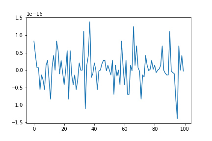

# First Homework
----------------
## the first task is my implementation of the Gaus method
​
## the second task is my implementation of the Cholesky method
## the third task is my implementation of the sweep method
