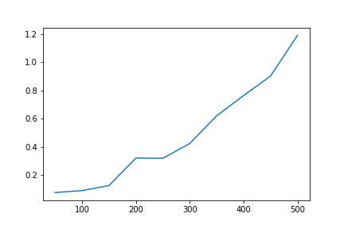
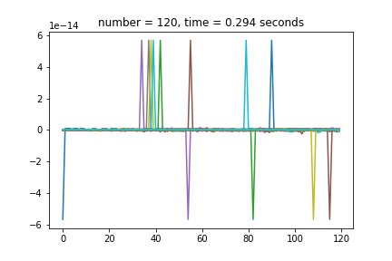
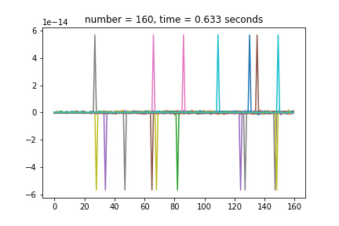
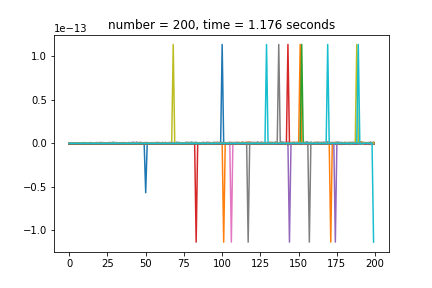
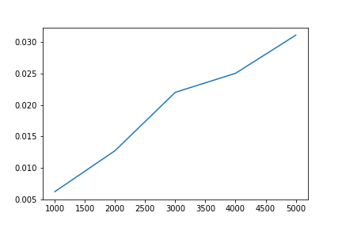

# First Homework
----------------
## The first task is my implementation of the Gaus method
The following five graphs compare the _calculation accuracy_ of my implementation of the Gaus method with the library __numpy.linalg.solve()__ for a matrix of dimensions 100x100, 200x200, 300x300, 400x400, 500x500.

As you can see, the algorithm calculates with an accuracy of ~ __10^-16__ (which is very good).

And this graph shows the dependence of the execution time on the dimension of the matrix. As you can see, the graph is similar to ___n^3___, which corresponds to the _complexity of the algorithm_.

## The second task is my implementation of the Cholesky method

The following five graphs compare the _calculation accuracy_ of my implementation of the Gaus method with the library __numpy.linalg.Cholesky()__ for a matrix of dimensions 100x100, 200x200, 300x300, 400x400, 500x500.

As you can see, the algorithm calculates with an accuracy of ~ __10^-13__ (which is very good).

And this graph shows the dependence of the execution time on the dimension of the matrix.

## the third task is my implementation of the sweep method

The following five graphs compare the _calculation accuracy_ of my implementation of the Gaus method with the library __numpy.linalg.solve()__ for a matrix of dimensions 100x100, 200x200, 300x300, 400x400, 500x500.

As you can see, the algorithm calculates with an accuracy of ~ __10^-6__ (which is very good).

And this graph shows the dependence of the execution time on the dimension of the matrix.

