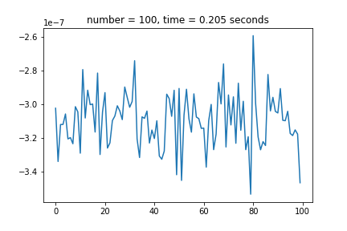
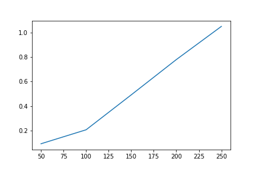

# Second Homework
----------------
## the first task is my implementation of the Jacobi method
### GETTING STARTED
 **to run this program execute this comand**
  ```
  jupyter notebook Jacobi.ipynb
  ```

The following five graphs compare the _calculation accuracy_ of my implementation of the Jacobi method with the library __numpy.linalg.solve()__ for a matrix of dimensions 100x100, 150x150, 200x200, 250x250.



As you can see, the algorithm calculates with an accuracy of ~ __10^-7__ (which is very good).

And this graph shows the dependence of the execution time on the dimension of the matrix.


## the second task is my implementation of the Zeidel method
### GETTING STARTED
 **to run this program execute this comand**
  ```
  jupyter notebook Zeidel.ipynb
  ```

The following five graphs compare the _calculation accuracy_ of my implementation of the Zeidel method with the library __numpy.linalg.solve()__ for a matrix of dimensions 100x100, 200x200, 300x300, 400x400.


As you can see, the algorithm calculates with an accuracy of ~ __10^-6__ (which is very good).

And this graph shows the dependence of the execution time on the dimension of the matrix.

