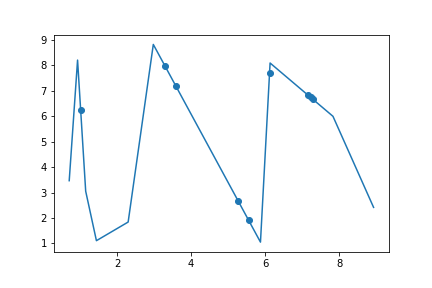

# Third Homework
----------------
## There is my implementations of the linear, Lagrange, spline interpolation**
### GETTING STARTED
 **to run linear interpolation execute this comand**
  ```
  jupyter notebook linear_interpolation.ipynb
  ```
 **to run Lagrange interpolation execute this comand**
  ```
  jupyter notebook Lagrange_interpolation.ipynb
  ```
 **to run spline interpolation execute this comand**
  ```
  jupyter notebook spline_interpolation.ipynb
  ```

### Train

Linear and Lagrange interpolation are trained on the grid x, y which are located in the "train" folder under the name "train.dat" and "train.ans" respectively. Since spline interpolation in my interpretation requires a uniform grid, for this I created a separate folder "train_for_spline_interpolation".

### FILL WITH RANDOM DATA

To automate the filling of the grid for training and the grid for checking interpolation, I wrote the program __fill_with_random_data.ipynb__

### Example of interpolation work
**Linear interpolation**



**Lagrange interpolation**

this graph shows the discrepancy between my implementation of Lagrange interpolation and the library __scipy.interpolate.Lagrange__


**Spline interpolation**


