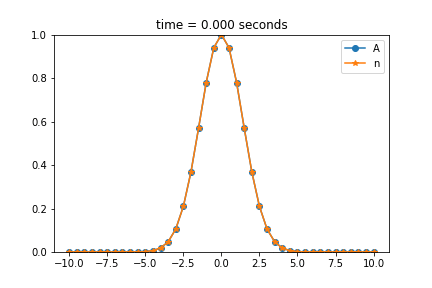

# TRANSFER and TERMAL CONDICTIVITY
### GETTING STARTED
 **to run termal condicitivity this comand**
  ```
  jupyter notebook termal_condictivity.ipynb
  ```
 **to run transfer  execute this comand**
  ```
  jupyter notebook transfer.ipynb
  ```

**Termal Condictivity**



**Transfer**


